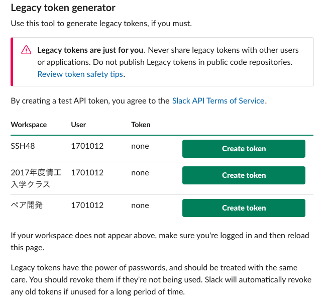

# エアー来んやん！
## 概要
 - エアー来んやん！は、Slackのグループ内で、部屋のエアコンの温度を投票によって変更することができるシステムです。
 Raspberry PiとGASを使用しています。
## 動作環境
### Raspberry PI
- Raspberry Pi 3 Model B+  
- OS:raspbian 9.9  
- python 3.5.3  
- php 7.0  
- Apache 2.4.25  
### GAS(Google Apps Script)
- JavaScript   

## Raspberryにインストール
管理者でログイン  
```   
sudo su    
```  
パッケージリストをアップデート  
'apt-get update'  
インストール済のソフトウェアをアップデート  
'apt-get upgrade'  
apacheをインストール  
'apt-get install apache2'  
PHPをインストール  
'apt-get install php7.0'

## Slackのアクセストークンを取得
[Slack Api](https://api.slack.com/custom-integrations/legacy-tokens)  
### 上記URLからSlackApiにアクセス

### 緑の Create tokenを押し、トークンを取得  
/src/Gas/main.js  
/src/Gas/resultsend.js  
/src/Gas/iconchangesend.js  
上記３箇所のjsファイルに指定されている箇所にコピペする  

## メンバー
- 木村魁人  
- 小嶋大地  
- 酒井春華  
- 田中奏多  
- 中西翔太郎  
- 中村賢哉  
